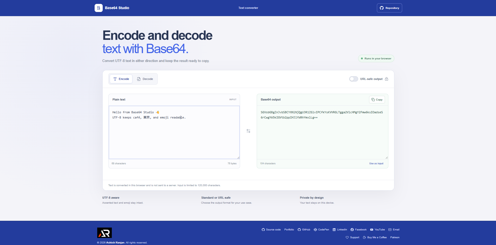

# Base64 Converter

Base64 Studio encodes and decodes UTF-8 text in the browser. It is intended for developers who need to inspect an encoded value, prepare text for a URL-safe field, or quickly convert a short string without sending it to a server.

**Live site:** [https://a2rp.github.io/base64-converter/](https://a2rp.github.io/base64-converter/)

## What is included

- An Encode and Decode mode that updates the result as text changes.
- UTF-8 conversion for accented characters, non-Latin scripts, and emoji.
- An optional URL-safe output format that replaces `+` and `/` and removes trailing padding.
- A character and byte count for the current input.
- A **Copy** button for the generated result and a **Use as input** action to reverse the current conversion.
- Clear feedback when Base64 syntax or decoded UTF-8 bytes are invalid.
- A responsive fixed header, public repository link, shared profile and support footer, and a **Back to top** control after scrolling.

## How to use it

Choose Encode to turn text into Base64 or Decode to turn Base64 back into text. Paste or type into the input panel and read the live result on the other side. Enable **URL-safe output** when the encoded value needs to use `-` and `_` instead of `+` and `/`. Use **Copy** to copy the result, or **Use as input** to place it in the input panel and switch to the reverse operation.

The tool accepts text only. It handles Unicode using UTF-8 and does not encode binary files. Inputs are limited to 120,000 characters.

## Privacy and storage

Conversion runs locally in the current browser page. Text is not sent to a server and the input is not saved to local storage. Reloading the page starts with the sample text again. Clipboard access requires a supported browser context, such as the deployed HTTPS site.

## Run locally

Use Node.js and npm, then run these commands from this directory:

```sh
npm install
npm run dev
```

## Checks and deployment

```sh
npm run lint
npm test
npm run build
npm run deploy
```

The tests cover Unicode round trips, URL-safe encoding, missing Base64 padding, and invalid Base64 or UTF-8. The deploy command builds the app and publishes `dist` to the `gh-pages` branch. Vite uses `/base64-converter/` as its GitHub Pages base path.

## Future improvements

These are ideas and are not implemented yet:

- Add a file mode for small binary and image data.
- Add a compact Base64 inspector for padding and byte length.
- Add optional line wrapping for long encoded values.
- Add a QR code preview for URL-safe output.

## Links

- Portfolio: [https://www.ashishranjan.net](https://www.ashishranjan.net)
- GitHub: [https://github.com/a2rp](https://github.com/a2rp)
- CodePen: [https://codepen.io/ash1198](https://codepen.io/ash1198)
- LinkedIn: [https://www.linkedin.com/in/aashishranjan](https://www.linkedin.com/in/aashishranjan)
- Facebook: [https://www.facebook.com/theash.ashish/](https://www.facebook.com/theash.ashish/)
- YouTube: [https://www.youtube.com/@ashishranjan-ashz?sub_confirmation=1](https://www.youtube.com/@ashishranjan-ashz?sub_confirmation=1)
- Email: [mailto:ash.ranjan09@gmail.com](mailto:ash.ranjan09@gmail.com)

## Support

- Support: [https://a2rp-donation-page.netlify.app/](https://a2rp-donation-page.netlify.app/)
- Buy Me a Coffee: [https://buymeacoffee.com/ashishranjan](https://buymeacoffee.com/ashishranjan)
- Patreon: [https://www.patreon.com/ashishranjan](https://www.patreon.com/ashishranjan)
